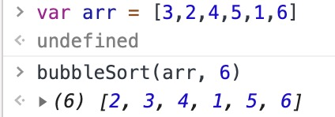
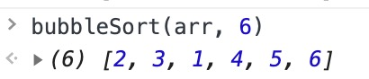
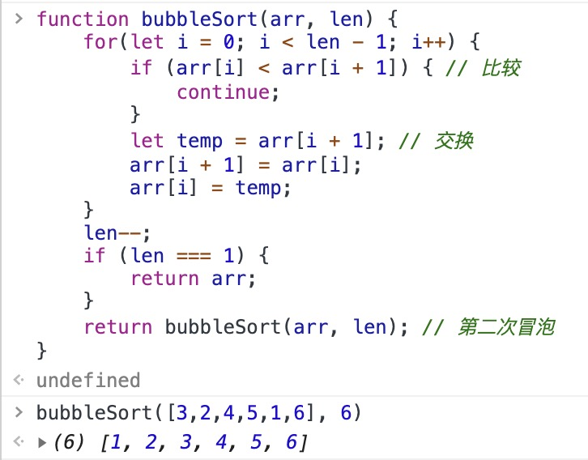
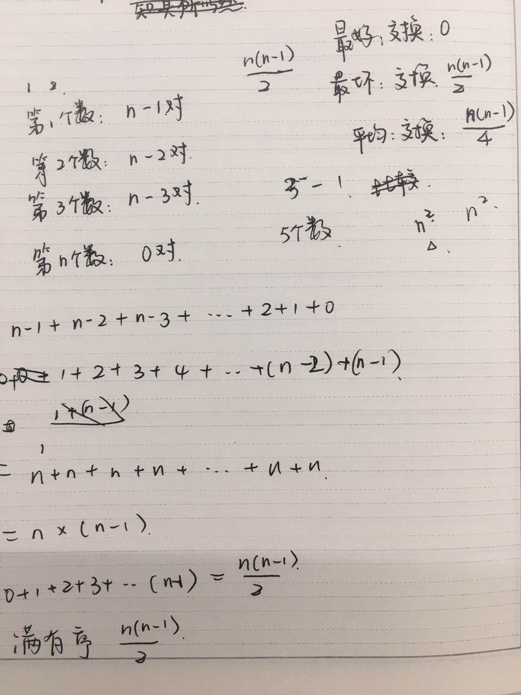
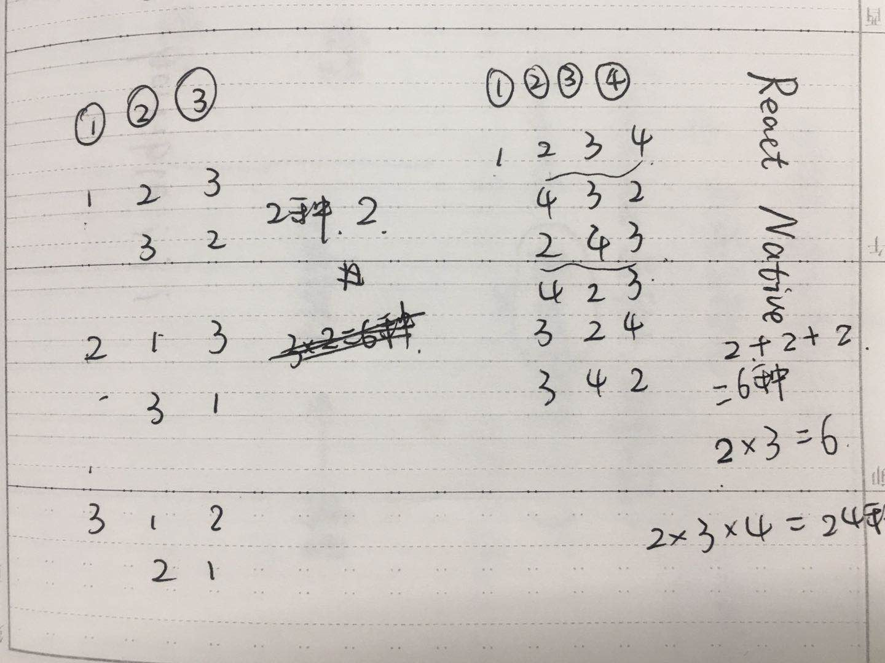

第一次写出来的冒泡是是这样的：
```
function bubbleSort(arr, len) {
    for(let i = 0; i < len - 1; i++) {
        if (arr[i] < arr[i + 1]) { // 比较
            continue;
        }
        let temp = arr[i + 1]; // 交换
        arr[i + 1] = arr[i];
        arr[i] = temp;
    }
    return arr;
}
```
分析：

设：arr = [3,2,4,5,1,6];

<center>
    
    <p>第一次冒泡的输出</p>    
</center>
第一次冒泡的实质是：比较+交换。当发生交换的时候，两个数之间变得有序，有序度增加1；交换后的第一个数与前面数的序度保持不变，交换后的第二个数与前面数的序度也保持不变，仅与前第一个数之间从逆序度变成了有序度，所以，每次交换的时候，有序度增加1，逆序度减少1。
<center>
    
    <p>第二次冒泡的输出</p>    
</center>
第二次冒泡还是否需要比较最后一个数：不需要。两两比较取最大，比较到最后的数一定是最大的。就好像a>b>c>d>e>f，那么a一定是最大的，并且排在最末尾。

所以，让数组继续冒泡，并且每次冒泡后，下一次的len减1，这里使用了递归：
```
function bubbleSort(arr, len) {
    for(let i = 0; i < len - 1; i++) {
        if (arr[i] < arr[i + 1]) { // 比较
            continue;
        }
        let temp = arr[i + 1]; // 交换
        arr[i + 1] = arr[i];
        arr[i] = temp;
    }
    len--;
    if (len === 1) {
        return arr;
    }
    return bubbleSort(arr, len); // 第二次冒泡
}
```
<center>
    
    <p>递归冒泡后的输出</p>    
</center>

优化：当一次冒泡没有任何数据交换的时候，是不是可以结束了？答：是。两两比较都是相同的关系，即前一个数小于后一个数，那就是a< b < c < d < e < f，排序已经出来结果。

<center>
    
    <p>计算n个数字能有多少种组合-草稿</p>    
</center>
<center>
    
    <p>计算n个数字的数组序度-草稿</p>    
</center>


平均时间复杂度的计算：概率推导出来的。包含n个数字的数组，一共有n!(阶乘)种组合。对这组数字查看数据的序度，从右往左，位置增大，高位的数字比低位的数字大，称为有序度，反之，称为逆序度。n个数字的数组序度是n*(n-1)/2（等差数列求和）。两个数字的关系要么是有序，要么是逆序，所以逆序度+有序度=序度。最终要达到的关系是完全有序，那么最好情况下，有序度=序度（满有序度），这时交换0次；最坏情况下，有序度=0，这时要交换n*(n-1)/2次。平均交换n*(n-1)/4次。比较的次数肯定要比交换的次数多，复杂度肯定大于O(n^2)，但是最坏情况的时间复杂度为O(n^2)。所以平均时间复杂度粗略地取O(n^2)。