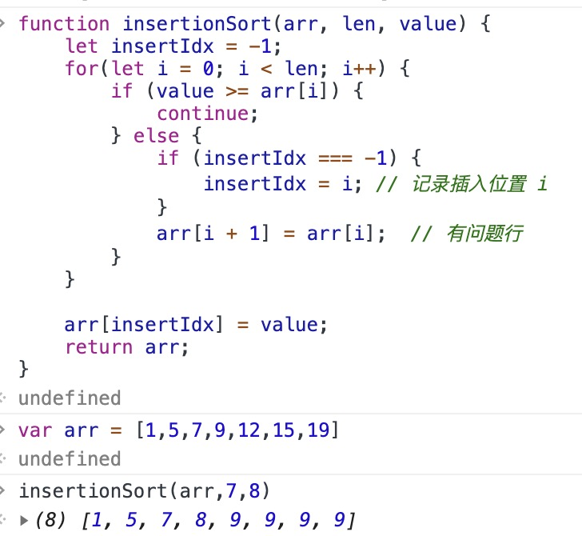
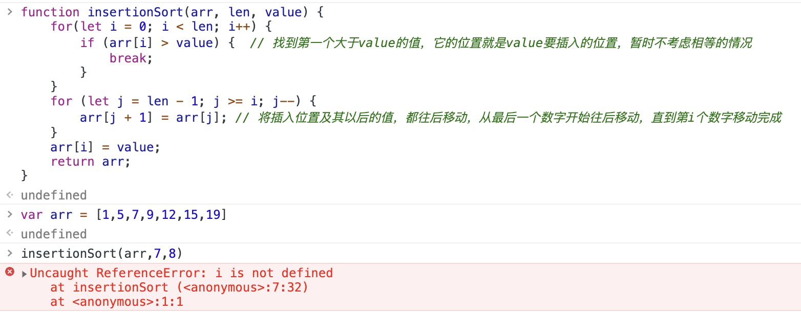
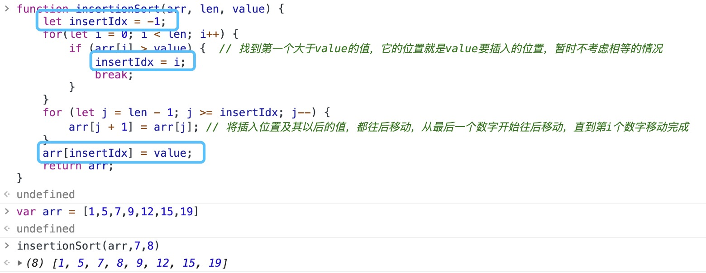
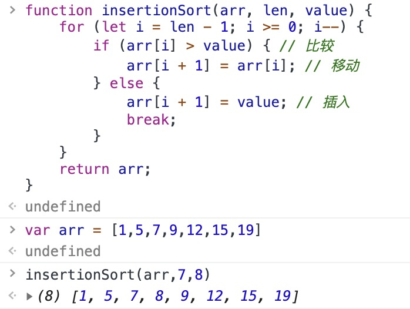
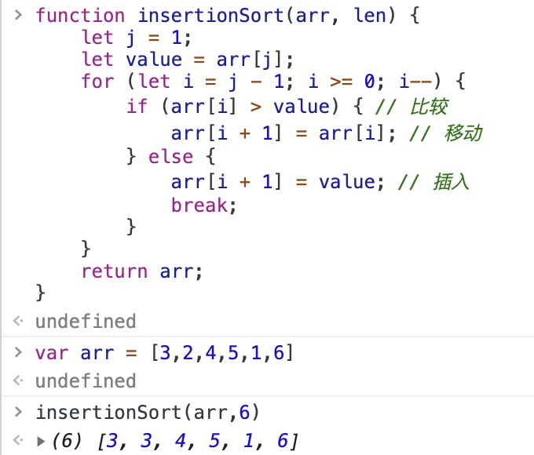
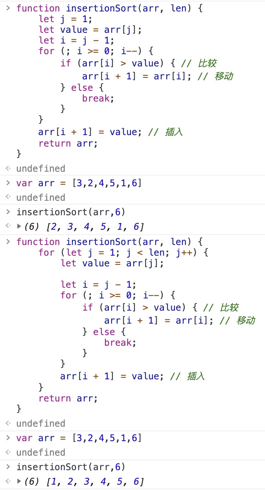

思路：知道其原理后，将问题拆分为子问题，先求解子问题，再来个循环，就可以搞定了！但是子问题的求解过程中，关注点有二：一是如何移动数组中的元素，二是细节bug。

移动数组：永远不能从第一个开始往后挪，这样会影响后面的循环。从最后一个开始往后挪，不会影响前面的数组。

细节bug：
* JS的for循环存在块级作用域，在使用let声明变量的时候，变量只能在块级作用域内被访问
* 遍历是从[0, n-1]
* 考虑两两比较相等的情况
* 循环的时候，如果把整个数组都走完了，插入步骤在循环体内可能会走不到..确实是这样，整个循环次数应该是n而非n-1

假设被插入数据的数组`var arr = [1, 5, 7, 9, 12, 15, 19]`;

    
    
子问题求解-错误1

    
    
子问题求解-错误2

错误1中的移动修改了后续循环的元素，所以错误2中使用了从最后一个数字开始循环，避免错误1中的错误。但是报错i

    
    
子问题求解-正确求解1

上面的代码是从前往后找插入位置，试试从后往前找，对比下哪个计算效率更高：

    
    
子问题求解-正确求解2

时间复杂度分析————

从前往后找：两两比较（小于continue 大于break)，找到对应位置，再从后往前地移动后面的所有元素。

从后往前找：两两比较（大于continue 并移动，小于插入并break)，找到对应位置，插入结束。

区别：第二种本身就是从后往前的，第一种先从前往后，再从后往前。

第一种时间复杂度：在任何地方插入都需要从前往后循环找位置，再接着从后往前移动元素，所以最好、最坏、平均时间复杂度为O(n)

第二种时间复杂度：最好情况下，在最后一个位置插入，时间复杂度为O(1)，最坏情况下，在第一个位置插入，时间复杂度为O(n)，平均情况下，一共有n+1种插入方式，每一种需要遍历的个数之和：1+2+3+..+(n+1)=(n+1)(n+2)/2，所以每种情况的平均遍历数为(n+1)(n+2)/2/(n+1)=（n+2)/2，所以平均时间复杂度是O(n)

两者比较，应取第二种。

    
    
子问题在插入排序中的应用验证结果

在循环内部插入，如果所有数都走了大于条件，插入的步骤都走不到...（有点坑了，所以在循环体外部去插入）

    
    
有点想落泪，终于成功了

总结：步步为营

时间复杂度分析：
最好情况：O(n)，最坏情况：(n(n+1)/2=O(n^2)，
平均时间复杂度：内部是一次插入操作，插入操作的平均时间复杂度O(n)，循环执行n-1次插入操作，所以平均时间复杂度是O(n^2)